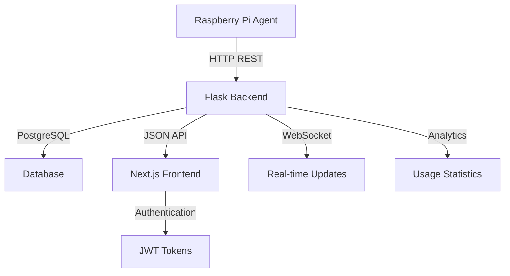

# WiFi Monitor - Project Status & Implementation Details

## 📋 Executive Summary

The WiFi Monitor is an intelligent IoT-based system designed to monitor and analyze WiFi network usage across all connected devices. The system leverages a Raspberry Pi agent for data collection, a robust Flask backend for data processing and management, and a modern Next.js frontend for visualization and control.

## 🎯 Project Goals

### Primary Objectives
1. **Real-time WiFi Usage Monitoring**: Track bandwidth consumption for all devices on a network
2. **Device Management**: Identify, categorize, and set data limits for network devices
3. **Intelligent Analytics**: Provide insights into usage patterns and trends
4. **Alert System**: Notify users when devices exceed data caps or unusual activity is detected
5. **Multi-Platform Access**: Web dashboard and future mobile application

### Secondary Objectives
1. **Predictive Analytics**: Machine learning models to forecast monthly usage
2. **Network Optimization**: Recommendations for improving network performance
3. **Cost Management**: Track and predict internet costs based on usage patterns

## 🚧 Current Implementation Status

### ✅ Completed Components

#### Backend (Flask API)
**Status**: Production Ready
- **Authentication System**: JWT-based user authentication and authorization
- **Device Management API**: Complete CRUD operations for device management
- **Usage Tracking API**: Endpoints for collecting and retrieving usage data
- **Agent Management**: Registration and monitoring of Raspberry Pi agents
- **Analytics Endpoints**: Statistical analysis and reporting APIs
- **Alert System**: Configurable notifications for usage thresholds
- **Database Layer**: PostgreSQL with SQLAlchemy ORM

**Key Features**:
```python
# Authentication & Authorization
/api/auth/login
/api/auth/register
/api/auth/refresh

# Device Management
/api/devices (GET, POST, PUT, DELETE)
/api/devices/{id}/usage
/api/devices/{id}/alerts

# Usage Analytics
/api/usage/statistics
/api/usage/trends
/api/usage/summary

# Agent Management
/api/agents/register
/api/agents/status
/api/agents/metrics
```

#### Frontend (Next.js Dashboard)
**Status**: Production Ready
- **Dashboard Interface**: Modern, responsive web interface
- **Device Management**: Add, edit, and monitor network devices
- **Real-time Monitoring**: Live usage statistics and visualizations
- **Data Cap Management**: Set and monitor device-specific limits
- **Analytics Views**: Usage trends, charts, and historical data
- **Alert Management**: Configure and view system notifications
- **Authentication**: Login/register with JWT token management

**Tech Stack**:
- Next.js 14 with App Router
- TypeScript for type safety
- Tailwind CSS for styling
- React components with modern hooks
- API integration with backend

#### Pi Agent (Simulator)
**Status**: Development/Testing Phase
- **Network Simulation**: Simulates device discovery and traffic monitoring
- **Data Collection**: Collects mock usage metrics
- **Backend Communication**: Sends data to central server
- **Configuration Management**: YAML-based configuration
- **Service Architecture**: Structured for easy deployment

### 🚀 In Development

#### Real Pi Agent Implementation
**Status**: Planned for Q1 2026
- **Network Scanning**: Using nmap and ARP scanning for device discovery
- **Traffic Monitoring**: Real packet capture and analysis
- **Hardware Integration**: Full Raspberry Pi deployment
- **System Service**: Systemd service configuration

**Technical Approach**:
```python
# Network scanning using nmap
def scan_network():
    nm = nmap.PortScanner()
    result = nm.scan(hosts='192.168.1.0/24', arguments='-sn')
    return parse_devices(result)

# Traffic monitoring using scapy
def monitor_traffic():
    packets = sniff(filter="ip", prn=process_packet, count=0)
    return aggregate_usage(packets)
```

### 🔮 Future Development

#### Machine Learning Integration
**Status**: Research Phase
**Timeline**: Q2 2026

**Planned Features**:
- **Usage Prediction**: LSTM neural networks for monthly usage forecasting
- **Anomaly Detection**: Identify unusual network behavior
- **Device Classification**: Automatic device type detection
- **Optimization Recommendations**: AI-driven network improvement suggestions

**Technical Approach**:
```python
# Usage prediction model
class UsagePredictionModel:
    def __init__(self):
        self.model = Sequential([
            LSTM(50, return_sequences=True),
            LSTM(50, return_sequences=False),
            Dense(25),
            Dense(1)
        ])
    
    def predict_monthly_usage(self, historical_data):
        # Predict next month's usage based on historical patterns
        pass
```

#### Flutter Mobile Application
**Status**: Design Phase
**Timeline**: Q2 2026

**Planned Features**:
- Native iOS and Android applications
- Push notifications for alerts
- Real-time usage monitoring
- Device management on mobile
- Offline data viewing

## 🏗️ System Architecture Details

### Current Architecture



### Data Flow

1. **Collection**: Pi Agent scans network and collects usage data
2. **Transmission**: Data sent securely to Flask backend via HTTPS
3. **Processing**: Backend validates, processes, and stores data
4. **Storage**: PostgreSQL database stores devices, users, and usage metrics
5. **Analytics**: Real-time analysis generates insights and alerts
6. **Visualization**: Next.js frontend displays data through interactive charts

## 📊 Technology Stack Details

### Backend Technologies
```yaml
Framework: Flask 2.3+
Database: PostgreSQL 13+
ORM: SQLAlchemy
Authentication: JWT (PyJWT)
Validation: Marshmallow
Testing: pytest
Documentation: OpenAPI/Swagger
```

### Frontend Technologies
```yaml
Framework: Next.js 14
Language: TypeScript
Styling: Tailwind CSS
Components: React 18
State Management: Context API + Zustand
Charts: Chart.js / Recharts
Authentication: JWT storage
```

### Pi Agent Technologies
```yaml
Language: Python 3.8+
Network Scanning: nmap, python-nmap
Packet Capture: scapy
HTTP Client: requests
Configuration: PyYAML
Service: systemd
```

## 🔧 Deployment Architecture

### Development Environment
- Docker Compose for local development
- Hot reloading for frontend and backend
- SQLite for development database
- Mock agent for testing

### Production Environment (Planned)
- Kubernetes or Docker Swarm
- PostgreSQL with replication
- Nginx reverse proxy
- SSL/TLS termination
- Monitoring with Prometheus/Grafana

## 📈 Performance Metrics

### Current Capabilities
- **Device Capacity**: Up to 100 devices per network
- **Data Retention**: 1 year of historical data
- **Real-time Updates**: 5-second refresh intervals
- **API Response Time**: <200ms average
- **Database Operations**: <50ms average query time

### Scaling Considerations
- Horizontal scaling for multiple locations
- Database sharding for large datasets
- Redis caching for frequently accessed data
- Load balancing for high availability

## 🔐 Security Implementation

### Current Security Measures
- **API Security**: JWT token authentication
- **Data Encryption**: HTTPS for all communications
- **Input Validation**: Comprehensive request validation
- **Access Control**: Role-based permissions
- **Privacy Protection**: No deep packet inspection

### Planned Security Enhancements
- **End-to-End Encryption**: Encrypted agent-to-server communication
- **Multi-Factor Authentication**: Enhanced user security
- **Audit Logging**: Comprehensive security event logging
- **Penetration Testing**: Regular security assessments

## 📅 Development Roadmap

### Q1 2026: Core Enhancement
- [ ] Deploy to actual Raspberry Pi hardware
- [ ] Implement real network traffic monitoring
- [ ] Enhanced device identification
- [ ] Performance optimization
- [ ] Comprehensive testing suite

### Q2 2026: Intelligence & Mobile
- [ ] Flutter mobile application
- [ ] Machine learning prediction models
- [ ] Advanced analytics dashboard
- [ ] Push notification system
- [ ] Anomaly detection algorithms

### Q3 2026: Scale & Enterprise
- [ ] Multi-location support
- [ ] Enterprise user management
- [ ] Advanced reporting features
- [ ] API rate limiting and quotas
- [ ] Third-party integrations

### Q4 2026: Advanced Features
- [ ] Cost tracking and billing
- [ ] Router firmware integration
- [ ] Advanced network optimization
- [ ] White-label solutions
- [ ] Enterprise support portal

## 🎯 Success Metrics

### Technical KPIs
- **System Uptime**: >99.5%
- **Data Accuracy**: >95%
- **Response Time**: <500ms
- **Device Detection Rate**: >90%
- **Data Collection Reliability**: >99%

### Business KPIs
- **User Adoption**: Target 1000+ active users
- **Feature Usage**: >80% feature utilization
- **User Satisfaction**: >4.5/5 rating
- **Support Tickets**: <5% of user base monthly
- **System Reliability**: <1% critical incidents

## 🤝 Contributing

The project is structured for collaborative development with clear separation of concerns:

- **Backend Development**: Python/Flask expertise
- **Frontend Development**: React/Next.js skills
- **Hardware Integration**: Raspberry Pi and networking knowledge
- **Data Science**: Machine learning and analytics
- **DevOps**: Infrastructure and deployment

## 📞 Support & Contact

For technical questions, feature requests, or deployment assistance, please refer to the documentation or open an issue in the project repository.

---

*Last Updated: January 2026*
*Next Review: March 2026*